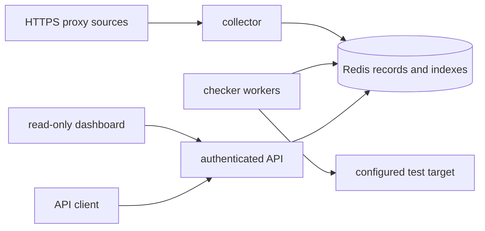

# 架构

系统是一个模块化单体，生产时按 API、collector、checker 三种独立进程运行。Redis 是唯一共享状态。collector 从维护者配置的 HTTPS 免费源下载有界响应，经 JSON、正则或 XPath 解析、全局地址校验和预测试后写入候选或可用记录。checker 先做目标直连基线检查，再原子领取到期任务、经代理探测、评分并完成租约。API 只执行有界查询。

每个域名池使用 `records` HASH 保存完整 JSON，`quality` ZSET 按分数查询，`due` ZSET 安排检测，`leased` ZSET 保存租约截止时间，`lease-owners` HASH 保存不可猜测 owner token。全局 `domains` SET 记录池名。领取、完成、释放和过期回收均由 Lua 原子执行；完成操作必须匹配 owner，防止迟到 worker 覆盖新结果。

评分只处理明确代理错误。目标、DNS、TLS 信任、Redis 和未知程序错误不扣代理分。目标基线连续失败会打开 Redis 共享熔断器；冷却后只有一个 half-open owner。候选代理必须在相隔 30–60 秒的检测轮次中通过，并在每轮同时通过主目标与独立出口目标；默认拒绝明显的 Cloudflare CDN 网段。查询和随机选择不加载完整池，分页、随机数、源页数、响应体、并发和单轮候选数均有硬上限。

仪表盘仍属于同一个模块化单体，不新增进程。collector 和 checker 写入有 TTL 的角色心跳；checker 通过 owner-token Redis 锁竞争每个五分钟桶的快照写入权。Redis 保存 5 分钟/小时两层有界历史，API 的 `DashboardService` 统一处理域名校验、聚合、心跳、缓存和历史读取。浏览器只加载同源静态资源，通过已有 `X-API-Key` 查询四个 `/v1/dashboard/*` 接口。

模块依赖方向为 `models/config/security` → `storage/checker/collector` → `api/runtime`。原始 `IPProxyPoolPro` 仅作为评估参考，不参与导入、构建、Git 或 Codegraph 索引。
